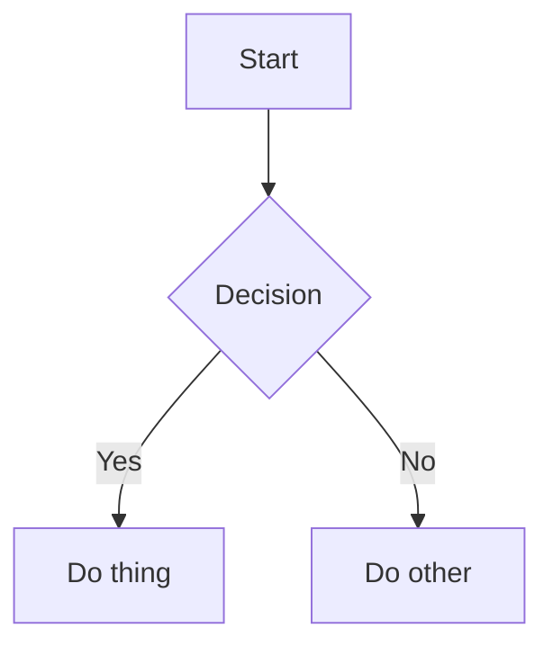

# Markdown Cheat Sheet

> [!TIP] Important Docs
> [Github Markdown Docs][github markdown docs]

## Core Markdown

### Emphasis

- **bold**
- *italic*
- ***bold+italic***
- ~~strikethrough~~   <!-- GFM -->

### Paragraphs + line breaks

- New paragraph = blank line
- Manual line break = two spaces at end of line (GitHub docs calls this out for .md files). 

```md
Line 1␠␠
Line 2
```
(␠ = space)

### Blockquotes
> Quote
> > Nested quote

### Lists
Unordered:
- item
* item
+ item

Ordered:
1. item
2. item

### Nested lists (indent carefully):

1. First
   - Nested
     - Nested deeper
 
### Task lists (GFM)
- [ ] todo
- [x] done
- [ ] \(Optional) thing

> [!NOTE] If a task item starts with parentheses, escape it.

### Links

[link text](https://example.com)

***Reference-style (clean for docs):***

[Docs][docs]

[docs]: https://example.com/docs

Images


## Tables (GFM)

| Col A | Col B |
|------:|:------|
| right | left  |

Alignment rules:
- :--- left
- ---: right
- :---: center

Workaround: multi-line content inside a table cell is messy; use <br> (HTML) if allowed:

| Col |
|-----|
| line1<br>line2 |

## “Drop-downs” / collapsible sections (GitHub + HTML)

<details>
  <summary>Click to expand</summary>

  Hidden details here (Markdown inside works on GitHub).
</details>
Expanded by default:

md
Copy code
<details open>
  <summary>Open by default</summary>

  Content...
</details>

## Footnotes (Github)

Here is a claim.^[nope]   <!-- not this -->

Here is a claim with a footnote.[^1]

[^1]: The footnote text.

## Callouts / alerts (GitHub)

> [!NOTE]
> Something helpful.

> [!WARNING]
> Something risky.

> [!TIP]
> Something tip worthy

## Math + diagrams (GitHub)

LaTeX math (GitHub)

Inline: $`\sqrt{3}`$

Block: 
```math
E = mc^2
```

Mermaid diagrams (GitHub + VS Code)



## HTML “power moves” (HTML; works where HTML is allowed)

### Resize / align images

Markdown can’t resize images by itself; HTML can:


> [!TIP] GitHub supports the <picture> element too (useful for light/dark-mode images).

### Keyboard keys
Press <kbd>⌘</kbd> + <kbd>K</kbd>

Centering (quick workaround)
<p align="center">
  
</p>

## GitHub/GitLab “social” extras (GitHub/GitLab)

Mention people/teams: @username (GitHub)

Reference issues/PRs: #123 (GitHub) 

Emoji: :shipit: (GitHub)


[github markdown docs]: https://docs.github.com/en/get-started/writing-on-github/getting-started-with-writing-and-formatting-on-github/basic-writing-and-formatting-syntax